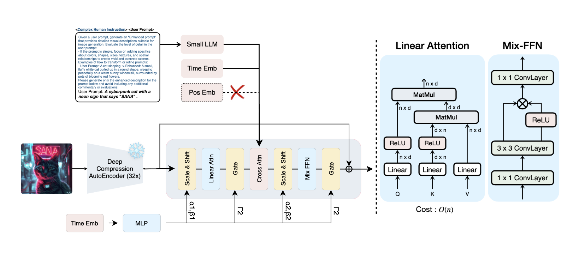

# SANA from Scratch

A minimal, readable reimplementation of NVIDIA's **[SANA](https://github.com/NVlabs/Sana)** text-to-image model in plain PyTorch.


**Who this is for:** anyone who wants to read a diffusion transformer end to end without a debugger.

---

## Architecture



The pipeline has three parts, only one of which is implemented here from scratch:

| Component | Role | Source |
|---|---|---|
| **Gemma-2 2B** | Encodes the text prompt into 300 × 2304 hidden states | 🤗 `transformers` |
| **SANA transformer (1.6B)** | Denoises a 32-channel latent, conditioned on text | **this repo** |
| **DC-AE (f32c32)** | Decodes the 32-channel latent into a 1024px RGB image | 🤗 `diffusers` |

At 1024px the DC-AE compresses the image 32× per side, so the transformer only ever sees a 32×32 latent — 1024 tokens at patch size 1. That, plus linear attention, is what makes SANA fast.

### Inside a SANA block

Each of the 20 blocks does three things, in this order:

1. **Linear self-attention (LiteLA)** — ReLU kernel on Q and K, then `K^T V` is computed *first*. This makes cost linear in sequence length instead of quadratic. A row of ones is padded onto `V` so the normalizer rides along in the same matmul.
2. **Cross-attention** — standard softmax attention from image tokens to the 300 Gemma text tokens, with a padding mask.
3. **Conv feed-forward** — a 1×1 expand, a 3×3 depthwise conv, a gated activation, and a 1×1 project. Tokens are reshaped back to 2D here, which gives the model local spatial inductive bias. **SANA has no positional embeddings**; this conv is where position comes from.

Timestep conditioning is AdaLN-single: one shared `scale_shift_table` per block produces six modulation vectors (shift/scale/gate for attention and for the feed-forward).

---

## Repository structure

```
attention.py      LiteLA (linear self-attention) + CrossAttention
feedforward.py    Conv-based gated feed-forward (the "no positional embedding" trick)
embeddings.py     PatchEmbeddings, TimestepEmbedder, CaptionEmbedder
sana_block.py     One transformer block + AdaLN modulate()
sana_model.py     Full model, 1.6B factory function, checkpoint loader
inference.py      End-to-end: prompt -> Gemma -> flow-matching sampler -> DC-AE -> PNG
architecture.png  Diagram above
```

Suggested reading order: `embeddings.py` → `attention.py` → `feedforward.py` → `sana_block.py` → `sana_model.py` → `inference.py`.

**Model config (1.6B / 1024px):** 20 blocks · hidden size 2240 · head dim 32 (70 heads) · MLP ratio 2.5 · patch size 1 · 32 latent channels · 300 text tokens · 2304 caption channels.

---

## Setup

### 1. Clone

```bash
git clone https://github.com/Bilal143260/SANA-from-scratch.git
cd SANA-from-scratch
```

### 2. Install dependencies

```bash
pip install torch torchvision transformers "diffusers>=0.32.0" accelerate huggingface_hub
```

A CUDA GPU with ~12 GB VRAM is recommended (inference runs in bf16). CPU works but is very slow.

### 3. Download the transformer checkpoint

`inference.py` expects the official `.pth` in the repo root:

```bash
huggingface-cli download Efficient-Large-Model/SANA1.5_1.6B_1024px \
  checkpoints/SANA1.5_1.6B_1024px.pth \
  --local-dir . && mv checkpoints/SANA1.5_1.6B_1024px.pth .
```

The other two components — `mit-han-lab/dc-ae-f32c32-sana-1.1-diffusers` and `Efficient-Large-Model/gemma-2-2b-it` — download automatically on first run.

---

## Running inference

```bash
python inference.py --prompt "a cyberpunk cat with a neon sign that says Sana"
```

Options:

| Flag | Default | Description |
|---|---|---|
| `--prompt` | *(required)* | Text prompt |
| `--steps` | `20` | Flow-matching Euler steps |
| `--guidance_scale` | `4.5` | Classifier-free guidance; `1.0` disables CFG |
| `--image_size` | `1024` | Output resolution (latent is size ÷ 32) |
| `--seed` | `0` | RNG seed for the initial noise |
| `--out` | `sana_out.png` | Output path |

Example with more control:

```bash
python inference.py \
  --prompt "a lone lighthouse on a cliff at dusk, storm clouds, oil painting" \
  --steps 30 --guidance_scale 5.0 --seed 42 --out lighthouse.png
```

### What `inference.py` actually does

1. Prepends SANA's **complex human instruction (CHI)** prefix to your prompt — a fixed block of text that steers Gemma into emitting a richer visual description. SANA was trained with it, so it isn't optional.
2. Encodes the result with Gemma-2's decoder and keeps the BOS embedding plus the last 299 positions → `(1, 300, 2304)`.
3. Encodes the empty string the same way for the unconditional branch.
4. Samples pure Gaussian noise and integrates the flow-matching ODE backwards with `FlowMatchEulerDiscreteScheduler` (shift 3.0), applying CFG at each step.
5. Divides the clean latent by the DC-AE scaling factor (0.41407) and decodes to RGB.

You can also sanity-check just the transformer with a random forward pass:

```bash
python sana_model.py
```

---

## TODO

- [x] Architecture implementation (LiteLA, cross-attention, conv FFN, AdaLN blocks, full model)
- [x] Inference pipeline with official checkpoint loading
- [ ] **Training code** — flow-matching loss, dataloader, latent caching, EMA
- [ ] **Custom CUDA/Triton kernel for linear attention** — fusing the ReLU kernel and the `K^T V` matmul
- [ ] **From-scratch DC-AE** — currently loaded from `diffusers`
- [ ] **From-scratch Gemma-2** — currently loaded from `transformers`

Contributions and corrections are welcome.

---

## Credits

Everything here is a reimplementation of NVIDIA's work. For the real thing — training recipes, all model sizes, SANA-Sprint, ControlNet, quantization and deployment — go to the official repository:

**[github.com/NVlabs/Sana](https://github.com/NVlabs/Sana)**

Papers:
- [SANA: Efficient High-Resolution Image Synthesis with Linear Diffusion Transformer](https://arxiv.org/abs/2410.10629)
- [SANA 1.5: Efficient Scaling of Training-Time and Inference-Time Compute](https://arxiv.org/abs/2501.18427)
- [Deep Compression Autoencoder (DC-AE)](https://arxiv.org/abs/2410.10733)

```bibtex
@misc{xie2024sana,
  title  = {Sana: Efficient High-Resolution Image Synthesis with Linear Diffusion Transformer},
  author = {Enze Xie and Junsong Chen and Junyu Chen and Han Cai and Haotian Tang and Yujun Lin and Zhekai Zhang and Muyang Li and Ligeng Zhu and Yao Lu and Song Han},
  year   = {2024},
  eprint = {2410.10629},
  archivePrefix = {arXiv}
}
```

The SANA weights are released under NVIDIA's NSCL v2-custom license, and Gemma-2 under the Gemma Terms of Use — check both before any non-research use.
